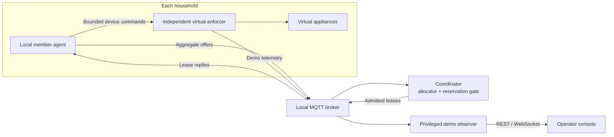
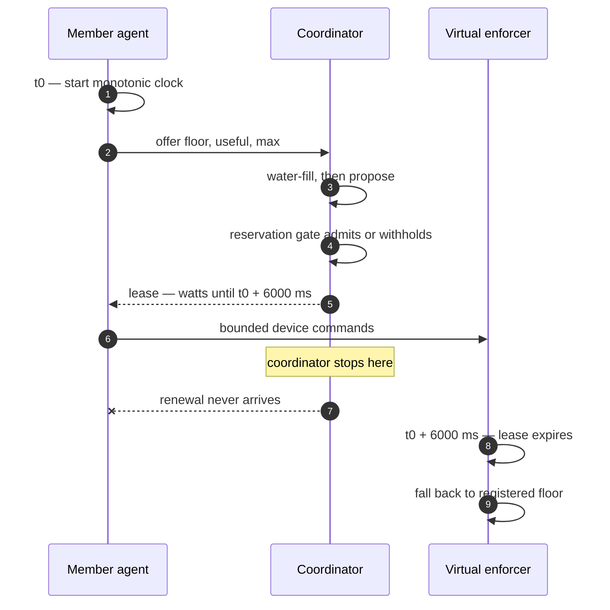

<p align="center">
  <picture>
    <source media="(prefers-color-scheme: dark)" srcset="docs/assets/truss-mark-dark.svg">
    
  </picture>
</p>

<h1 align="center">TRUSS</h1>

<p align="center"><strong>A coordination layer for shared electrical capacity.</strong></p>

<p align="center">
  Private household decisions&nbsp; ·&nbsp; Fairer access to limited power&nbsp; ·&nbsp; Permissions that expire locally
</p>

<p align="center">
  
  
  
  
  
</p>

<p align="center">
  <a href="#quick-start">Quick start</a>&nbsp; ·&nbsp;
  <a href="#how-it-works">How it works</a>&nbsp; ·&nbsp;
  <a href="#the-90-second-demo">Demo</a>&nbsp; ·&nbsp;
  <a href="#the-website">Website</a>&nbsp; ·&nbsp;
  <a href="#scope-and-limits">Limits</a>&nbsp; ·&nbsp;
  <a href="#tests">Tests</a>&nbsp; ·&nbsp;
  <a href="#documentation">Docs</a>
</p>

<p align="center"><sub>Code2Create 7.0&nbsp; ·&nbsp; ACM-VIT&nbsp; ·&nbsp; graVITas ’26</sub></p>

---

> ### Safety is a property of the protocol, not of the planner.
>
> Stop the coordinator. Leave the household enforcers running. Watch flexible draw fall away
> on its own as permissions expire — with no message telling it to.

## The problem

Hostels, homes and small buildings often share one constrained feeder, inverter or backup
supply. Everyone's demand fits at one moment and overshoots the next.

The usual answers are both bad. Let each household decide alone and there is no site-wide
agreement about who should wait. Trip the whole supply and you cannot tell a fridge from a
water heater.

**Truss proposes a third option:** register your minimum in advance, share what is left over,
and make every permission temporary. The coordinator never sees your appliance list — only an
aggregate offer.

The genuinely hard part is not sorting devices into "important" and "not". It is what happens
when things go wrong:

- A permission arrives *after* it was useful.
- An old, larger permission is still live when a smaller one is proposed.
- A coordinator restarts and has to account for authority it issued before it crashed.

Truss makes those three cases visible, reproducible and testable.

> [!IMPORTANT]
> This is a working **local software prototype**. Appliances and electricity readings are
> virtual. It does not switch mains voltage, control medical equipment, claim certification,
> or claim energy savings.

## How it works



**1 · Register the minimums.** Every household has an approved floor and maximum. Protected
loads are reserved for the whole run. A new offer can never raise your own registered floor.

**2 · Publish flexibility.** Each agent describes its aggregate demand envelope. Its *local*
scheduler decides which appliances run inside whatever permission comes back.

**3 · Propose a fair share.** Water-filling distributes surplus above the floors, up to useful
demand. Small askers are satisfied in full; large askers split the remainder equally.

**4 · Check outstanding authority.** A proposal is not a permission. The reservation gate
counts earlier leases that may still be in use — silence never frees capacity early.

**5 · Expire locally.** A lease lasts six seconds from the member's *request start* on its own
monotonic clock, so a slow reply can never quietly extend it. Nothing is ever sent to switch a
load off. Permission simply runs out.



### What "fair" means here

For fixed inputs and weights the continuous allocator is **weighted max-min fair on surplus
above registered floors**; implemented whole-watt targets round down. That is *not* a claim
that total household watts are equal, or that appliance service is instantly fair.

The optional weight is `1 + min(credit_wh / 10, 1)`. Credits describe withheld
**authorisation** measured against an equal-surplus reference — not measured sacrifice, saved
energy, or guaranteed repayment. The 2× cap is a demonstration policy choice, and an
overstated `useful` figure can still game allocation inside the registered envelope.

## Quick start

Run everything from the repository root. **Linux is the verified host platform.** One PC,
loopback networking, no cloud service and no internet once dependencies are installed.

### Prerequisites

| Requirement | Notes |
|---|---|
| **Python 3.12+** | The lock file was captured on Linux with Python 3.14. |
| **Node.js 22.12+** and npm | |
| **Mosquitto** (incl. `mosquitto_passwd`) | The live supervisor starts its *own* broker — no system service needed. Set `TRUSS_MOSQUITTO` if it is outside `PATH`. |
| *Optional* — C++ compiler | Native display-protocol tests. |
| *Optional* — PlatformIO | Building the ESP32 firmware. |

### 1 · Install and validate

```bash
python -m venv .venv
.venv/bin/python -m pip install -r requirements.lock
.venv/bin/python -m pip install -e . --no-deps
npm --prefix web ci
.venv/bin/truss check-config
```

### 2 · Start three terminals

```bash
# Terminal 1 — live virtual-device backend
.venv/bin/truss live --port 8001
```

```bash
# Terminal 2 — independent mock, and the Lab's benchmark API
.venv/bin/truss mock --port 8000
```

```bash
# Terminal 3 — website
npm --prefix web run dev -- --port 5173 --strictPort
```

Open **<http://localhost:5173>**. The [console](http://localhost:5173/console) defaults to
**Live runtime** — wait for startup recovery to finish and readings to go fresh before running
a drill.

| Local service | Port | Purpose |
|---|---|---|
| Vite website | `5173` | Pages, local assets, API proxies. |
| Live API | `8001` | Real local process control, virtual observations, recordings. |
| Mock API | `8000` | Explicit synthetic preview; also serves Lab benchmarks. |
| Owned MQTT broker | `18883` | Traffic between the live processes. |

The console reaches the live backend through `/console-api` and `/console-ws`; mock preview and
Lab use `/api` and `/ws`. **There is no silent live-to-mock fallback.** For frontend-only work,
start terminals 2 and 3 and pick **Mock preview** — live drills and policy mutation are
disabled there, and mock illustrations do not establish real process behaviour.

Keep the service terminals open. Stop a live run with `Ctrl+C` in its owning terminal so the
supervisor can clean up its children.

> `npm --prefix web run build` typechecks and emits `web/dist`. The development setup relies
> on Vite's proxies. For a production build with all services on one URL, use the
> [Heroku hosting setup](docs/heroku.md), which includes its own combined server.

## The 90-second demo

The shipped configuration has **five households, 900 W of registered minimums, a 100 W site
reserve and a 5,000 W cap**.

1. **Console → Live runtime.** Point at the four values that are deliberately distinct:
   *proposed*, *issued*, *reserved*, *observed*.
2. **Run "Coordinator stops".** The console kills the real coordinator process, samples the
   independent enforcers while it is gone, then restarts it. Keep the page open through
   recovery.
3. **Open "Why this allocation?"** for one household — separating its registered minimum, its
   outstanding permission, and its own local appliance decisions.
4. **Run "Minimums do not fit".** The site reports a shortage. It does not invent capacity and
   it does not lower a protected minimum to make the warning go away.
5. **Compare the fairness policies** and download the inputs and results. This comparison is an
   idealised illustration, separate from live lease behaviour.
6. **Open a recording in Evidence**, or use **Lab** to measure allocator cost from 5 to 5,000
   members. Neither touches live permissions.

Binary appliance steps can strand allocated watts, so observed draw need not equal issued
watts. Drills report **observed**, **inconclusive** or **failed** — never "safe".

## The website

The demo front end is a single React app with six pages, all offline: every font, model and
image is vendored into `web/public/`, and nothing is fetched from a CDN at runtime.

| Page | What it is for |
|---|---|
| **Home** | An infinite 3D card marquee introducing the idea in six short topics. |
| **Info** | Background on the problem statement. *Shell only — content is the next piece of work.* |
| **Example** | A walkable 3D site — three homes, a shared generator, live wiring. Press <kbd>F</kbd> to enter, <kbd>WASD</kbd> to move, <kbd>V</kbd> for first person, <kbd>E</kbd> at a door to step inside and see each home's appliances, agent and pulsing wires. Press **E near the coordinator** to open its enclosure in the same Three.js scene. The camera frames the allocator, validator, reservation gate, MQTT broker, message wiring and two curved hologram meshes. They use the website theme and update with the supply slider. E/Escape returns to the walk; scroll zooms for inspection. The example shows proposals and projected local draw, not live grants or telemetry. The scene illustrates the protocol with **three** homes for legibility; the live runtime in the console carries **five**. |
| **Console** | The operator console: capacity controls, allocation explanations, failure drills, evidence and replay. |
| **Lab** | Measured allocator benchmarks with raw samples, median and p95. |
| **Credits** | The team. *Shell only — the names currently live on a board inside the 3D site.* |

Both themes are first-class — navy/black in dark, light blue/white in light — including labels
and boards rendered *inside* the 3D scene.

## What is in the build

| Area | Implemented |
|---|---|
| **Live local runtime** | Authenticated MQTT broker, five household agents, five independent virtual enforcers, coordinator, observer, operator API. |
| **Allocation** | Equal-surplus water-filling by default; selectable service-deficit weighting capped at 2×. |
| **Expiring authority** | Six-second leases anchored to the member's request start, conservative reservations, durable coordinator epochs, 6.4 s recovery hold on every boot. |
| **Operator console** | Separate proposed / issued / reserved / observed watts, allocation explanations, lease estimates, capacity and rule controls, explicit stale and unknown states. |
| **Failure drills** | Coordinator loss, delayed grants, household partition, two rapid restarts, infeasible minimums — each with sampled reports and recovery attempts. |
| **Fairness comparison** | Labelled, read-only comparison of two policies on one demand trace. Issues no live permissions. |
| **Minimum review** | Export an unreviewed proposal to raise a registered minimum. The console cannot apply it or downgrade a protected load. |
| **Evidence and replay** | Event history, downloadable console evidence, read-only playback of saved snapshots. |
| **Allocator lab** | Synthetic batches from 5 to 5,000 members, measured in the UI. |
| **3D site walkthrough** | Animated character, house interiors, per-appliance models, current-flow pulses, coordinator internals rendered in the scene. |
| **Optional ESP32 screen** | USB status display for the virtual site. **No control authority.** |

The runtime is deterministic and non-AI. SGLang, appliance-criticality classification and
CP-SAT are outside this build.

## Repository map

```text
src/truss/                  Protocol cores, live processes, API, evidence
web/src/console/            Console controls, drills, comparison, replay
web/src/routes/             Pages — Showcase, Example, Console, Lab
web/src/components/         Brand, navigation, 3D scene and shared visuals
web/public/                 Vendored fonts, images and models (offline)
config/                     Demo registry, private profiles, MQTT templates
fixtures/                   Wire examples, JSON Schemas, OpenAPI, scenarios
tests/  ·  web/tests/       Python and frontend test suites
firmware/status-display/    Optional ESP32-S3 / GC9A01 firmware
docs/                       Architecture, contracts, evidence, runbook
research/  ·  plans/        Source ledger, technical review, design decisions
scripts/                    Dependency setup and fixture helpers
runtime/                    Generated run state and evidence (git-ignored)
```

## Tests

```bash
.venv/bin/pytest -q              # cores, properties, API, real-process integration
npm --prefix web test            # contracts, controls, evidence boundaries, rendering
npm --prefix web run build       # TypeScript and production bundle
```

**Last full run — 7 September 2026: 65 Python tests and 37 frontend tests passing, with a
clean production build.**

Hypothesis exercises allocation bounds and protocol state sequences. Integration tests drive
real MQTT and process failures against independent virtual observations. Frontend tests cover
source isolation, uncertain-operation retries, stale readings, drill recovery, replay cleanup
and repeated snapshot rendering.

> [!WARNING]
> **Read the skipped-test count.** Real-process tests skip when broker dependencies are
> missing, and the remaining passes do not reproduce live failure evidence. Run disruptive
> integration checks *separately* from a timed demonstration on the same PC. The late-reply
> drill's individual lease-rejection check stays inconclusive when those acknowledgements are
> absent from the event stream. Finite test results are not proofs over arbitrary failures.

## Scope and limits

We would rather state these than have them found on stage.

- **Virtual enforcement only.** No mains switches, no medical appliances. A registered minimum
  is a software agreement, not a guarantee of supply to any real device.
- **Timing carries assumptions.** Local enforcers must stay alive and clocks must satisfy the
  stated bounds. Whole-PC suspension, frozen enforcers and arbitrary scheduler delays are
  outside the guarantee; a persistent enforcement fault withdraws normal status.
- **A lower cap is not instantly enforceable.** Earlier permissions stay outstanding until they
  expire. Reservations may exceed a newly reduced cap — or conservatively exceed it during
  restart recovery, while new grants are withheld. Infeasible minimums are reported explicitly.
- **The trust boundary is incomplete for hostile devices.** The virtual plant checks identities,
  references, amounts and deadlines, but still trusts the member to forward genuine coordinator
  authority. This is not Byzantine-safe or production-secured.
- **Privacy is bounded.** Appliance detail is hidden from the coordinator by role and topic
  access — not encrypted against the broker, the host administrator or the privileged demo
  observer. Aggregate offers can still leak patterns.
- **Whole appliance steps strand capacity.** The local scheduler skips a binary load that will
  not fit; a second cross-household pass to reclaim those watts is not implemented.
- **Benchmarks are narrow.** The allocator is `O(n log n)` in member count. Lab timings exclude
  MQTT, persistence, IPC and enforcement — no end-to-end scalability claim is made.
- **Recordings are bounded.** Recording stops at 32 MiB or 10,000 frames; replay preserves the
  recorded prefix and exposes gaps rather than fabricating measurements.

## Documentation

| Guide | Use it for |
|---|---|
| [Architecture](docs/architecture.md) | Backend boundaries, module responsibilities, build interfaces. |
| [Protocol](docs/protocol.md) · [OpenAPI](fixtures/openapi.json) | Message shapes and backend/frontend contracts. |
| [Backend extensions](docs/backend-extensions.md) | Debt accounting, fault controls, replay sessions, benchmarks. |
| [Protocol repairs](plans/18-protocol-repair.md) | Lease timing, recovery, reservation and fairness assumptions. |
| [Runbook](docs/runbook.md) | Process ownership, broker setup, recovery procedures. |
| [Demo run-sheet](docs/demo-runsheet.md) | What to say and click, in order, when presenting. |
| [Research review](research/2026-09-06-review.md) · [Sources](research/sources.md) | Prior art, challenged claims, evidence classification. |
| [ESP32 display](docs/esp32-display.md) | Wiring, firmware, USB bridge, display-only limits. |
| [Build order](BUILD_PLAN.md) · [Contributions](docs/contributions.md) | Delivery dependencies and contribution record. |

Some dated handoffs predate the live console. **Use this README for current startup and UI
steps.** Historical test counts belong to their recorded configuration — do not combine them
into a new result.

## When something goes wrong

| Symptom | Next step |
|---|---|
| Console waits for live data | Check the live service on `8001` and its `/api/v1/health`. Only select Mock preview if you actually want synthetic data. |
| Readings say *unknown* | Inspect freshness and process status. Missing telemetry is not zero consumption. |
| An action is unconfirmed | Use **Check / retry the same operation**. Never rebuild that action with a new request ID. |
| A drill needs manual recovery | Read its operation trail and process status before acting again. Keep the report; a countdown is not proof of recovery. |
| An enforcer has a persistent fault | Preserve the run's evidence and investigate the timing gap. Restarting only the coordinator does not clear a plant fault. |
| Minimums do not fit | Restore a feasible cap, or revise the agreement for a new reviewed run. Never lower protection just to clear the warning. |
| A recording ends early | Check the recording-limit notice. The saved prefix is evidence only for the interval it covers. |

Generated credentials, authority databases, private notes and recordings live under ignored
paths. **Preserve the authority database during coordinator recovery — deleting it is not a
repair.**

## Credits

Built by **Pranav**, **Logesh**, **Prashanth**, **Kevin** and **Kalyan** for Code2Create 7.0,
ACM-VIT, graVITas ’26.

### Third-party assets

All bundled media is redistributable and vendored locally so the demo runs with no network.
Per-file provenance for every 3D model is recorded in
**[`web/public/models/ASSET-NOTICE.md`](web/public/models/ASSET-NOTICE.md)**.

| Asset | Source | Licence |
|---|---|---|
| Buildings, vehicle | KayKit — City Builder Bits | CC0 1.0 — [licence](web/public/models/KAYKIT-LICENSE.txt) |
| Appliances | KayKit — Restaurant Bits | CC0 1.0 — [licence](web/public/models/KAYKIT-RESTAURANT-LICENSE.txt) |
| Lamps | KayKit — Furniture Bits | CC0 1.0 — [provenance note](web/public/models/ASSET-NOTICE.md) |
| Character rig | three.js examples — `RobotExpressive` | CC0 1.0 |
| Space Grotesk, IBM Plex Mono | Vendored `.woff2` Latin subsets | SIL Open Font License 1.1 |
| Topic imagery | Wikimedia Commons, recoloured | Public domain / CC0 |

### Licensing

A project-wide licence has **not yet been declared**. Third-party dependencies and media keep
their own licences and notices; bundling them does not place this repository under those terms.

<p align="center"><sub>Truss — share the capacity, keep the promises.</sub></p>
